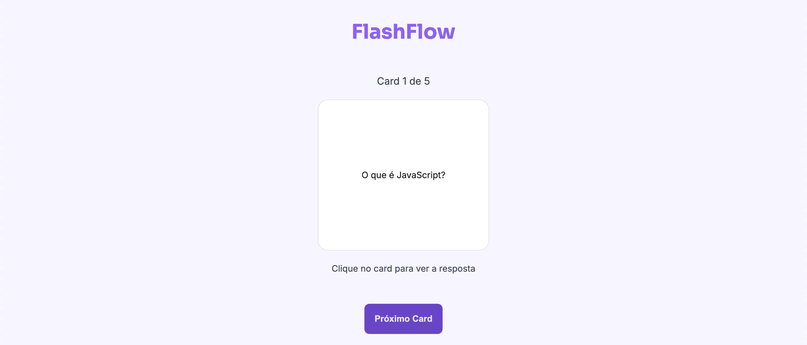

# 🚀 FlashFlow

FlashFlow é um projeto desenvolvido como parte do desafio da pós-graduação **Dev Start** da **Rocketseat**.  
O objetivo foi criar um sistema simples de flashcards utilizando apenas **HTML**, **CSS** e **JavaScript puro** (sem frameworks).

---

## 🧠 Desafio

O desafio consistia em:

- Receber um array de perguntas e respostas.
- Exibir uma **carta com a pergunta**.
- Ao clicar na carta, revelar a **resposta**.
- Um botão abaixo da carta permite **avançar para a próxima pergunta**.

---

## 💻 Tecnologias Utilizadas

- HTML5
- CSS3
- JavaScript (Vanilla JS)

---

## ✨ Funcionalidades

- Exibição de flashcards com perguntas.
- Clique no card para revelar a resposta.
- Botão "Próxima" para navegar entre os cards.
- Reinício automático após o último card.

---

## 📸 Prévia do Projeto



---

## 📂 Como executar

1. Clone o repositório:

```bash
git clone https://github.com/brianrecoba/flashflow-rocketseat.git
```
